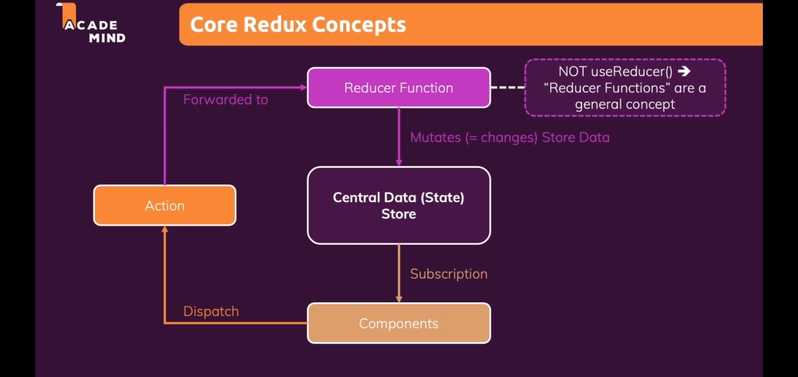
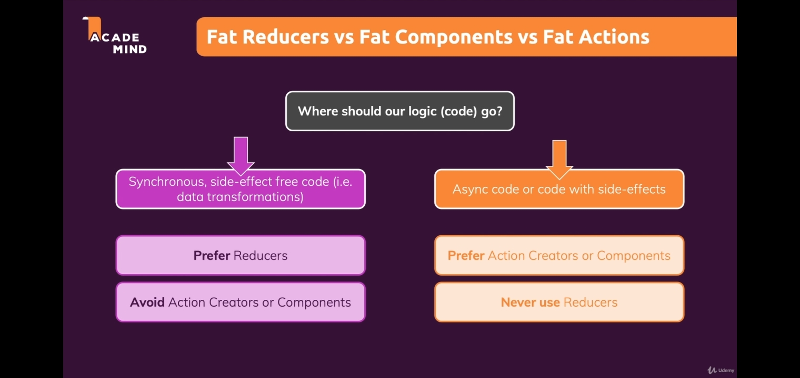

# Framework VS Library

- ReactJs is a library whereas AngularJs is a framework.

| Framework                                                                                            | Library                                                                                    |
| ---------------------------------------------------------------------------------------------------- | ------------------------------------------------------------------------------------------ |
| It is difficult to replace frameworks                                                                | A library is easy to be replaced with another library.                                     |
| A framework development requires a lot of code that decrease performance and increase the load time. | Building a library requires less code , so there is better performance and fast load time. |
| Its example are AngularJS , Spring , NodeJS , etc.                                                   | Its example are JQuery , React JS , etc.                                                   |

# Chp 2

## JSX

- It is the extension of React which refers to Javascript and XML (html) as we use both html and js in same file of react.

## Components

- Components in react are just JS functions.
- We break big project components as smaller components to make it more organized and easy to understand and go to the function directly.
- We don't specify the extension.
- Custom made components must start with **Uppercase** and we also need to export it.

## 1 root element

- There must be only one root element while adding HTML code in js file.
- One root means it can have multiple lines of HTML but the first and it must be wrapped in an Html element like **div**.

## HTML inside JS explained

- It is not actually HTML but JSX syntax invested by React.
- Therefore it is JS itself.

## Adding JS in HTML code

- We use curly braces to insert any variable of JS inside the HTML code in JSX file itself.

## props

- To link 2 different files to change a component we use the concept of props.
- Sometimes we might want to change certain **component** from different file and to link them we must pass an argument in the of first file function and need to specify the variable which we use in the second file.
- We create object and then access the value from key in the HTML in second file.
- props refer to the file in which the function is being used.

## Way to get date format in JS

- **toLocalString** can be used to get the date and month.
- **getFullYear** for year.

## render()

- The first element will be the one which will be used to replace the content of second element.

## children props

- children is a reserved prompt and the value is always the content between the opening and the closing component.
- Whenever we want to create wrapper of our own , we use **.children**.
- To give mulitple classes to it , we need to store the classes in the variable and add **.className** with it which says that all the class mentioned will be added into the child variable.

## useState in React

- useState is one of the **hook** functions and we always use it inside any component but not inside any nested function or outside the component.
- Whenever we use react , the execution of the files take place only once . Means whenever we want to update any file component (the function which we write) , it doesnt change it ie this **('')**.
- Always give the initial value in the paranthesis.
- If we want to change anything in JS , we need our executer to go back to the file and read the component again .
- **useState** here comes into picture , it accepts two arguments **(oldName , newName)/(nameStored , newNameAssign)** . The newName can be updated as a function where ever needed.
- Use destructing of arrays in this to assign variable to both the outputs , one oldValue and second newValue.
- We cannot update the value using the equal to sign because when we call it as a function then it says the executer to **rerun** the component , which we need.

## useState dependant on prev value

- Many times we are using previous values so we can append them, therefore whenever our data is dependant on previous values use second argument of useState as a function and pass the storedValue argument (first arg of useState) as arg of this function .
- Use spread operator to get all the storedValues.

## Dynamicallyn adding array el

- We can do this by using map method and avoid manually adding each elements into the file.

# Chp 6 , 7 , 8 , 9

## Styled components

- write **npm install --save styled-components** to use it.
- Then **import** it in files and then we can use it.
- Write all the CSS styles inside the **template literals** and use **&** before using any class, other HTML element or pseudo class.
- Dont need to give primary class name, ie , first class name. For second class name u can specify it inside the place its used and also can use ternary operator to give its condition.
- You can also directly use **media query** inside the curly braces of any class styling.

## .module.css

- Here we can use CSS styling in JS by importing the particular CSS file which is named as .module.css .
- Search more if wanna learn.

## Debug in inspect

- Can visit any file from inspect and debug it to find the errors .
- Can see the property value after hover.

## React Dev Tools

- This is a way to find many informations like linking of files , find the text , get the id , props , function name , etc etc .
- Download react dev tools extension from google and visit **Components** in the lists of console dropdown.

## Function inside function

- While using a normal function as a callback function (means used under our file function) , then we dont use paranthesis because we dont want to execute the function as soon as it reaches the line but rather want to make it used whenever required.

## Blank the input field

- When we want our input field to blank after submission , make sure to give input HTML element the **value** attribute.
- This will store the oldValue in it , and then we can change the new value to blank string ie **newValueVariable('')**.

## Removing the error module on click

- To remove the error msg by clicking on any button or the backdrop , we need to give the **onClick** effect on the ErrorModal js file which will create and must assign **props.anyName** and then use this name (anyName here) in the **ErrorModal** Component where it'll be used.

## Lifting State Up

- When we want to connect two sibling components , then we find a common file to connect the two files .
- We use the data from that common file which acts as middle file between the two.
- This helps us to maintain small components of a big file.

## Wrapper & React.Fragment

- We can create a file as wrapper class of any name which will only contain the **props.children** and nothing else.
- Through this we can use adjacent wrapper classes .
- Otherwise without this we couldn't have used adjacent wrapper classes.
- **React.Fragment** is another way to wrap two or more wrapper classes and here we also dont need to create a new file .
- **React.Fragment** is a buildin wrapper class.

## Portals

- We may have times when we want to render the html elements at the top even if they are nested inside the other html files .
- We can arrange the html components in the **Elements** of inspect using portals.
- If any nested element is stored deep inside the files , and we want it outside then portals is the way to go.
- We can create a variable and store the html elements of the file into it and can use those variables inside the return statements as **React.DOM.createPortal()** .
- Search more for details.

## useRef

- We can use useRef to always quickly display any value inside the console .
- Avoid using innerHTML , innerText , etc properties using **document.** , replace it with **useRef** .
- It always returns the string value , so to change it to int whereever necessary , we can use **+varName**.
- We can use it like **assignedName.current.value** to get the value of any input or any html element where we use ref.
- Otherwise we have to use useState for it. If we dont want any changes , then we must use **useRef** else **useState** is also good.

```JS
  const inputRef = useRef();
//   To see all the properties of useRef.
    console.log(inputRef);
    console.log(inputRef.current.innerHTML);
```

## Uncontrolled & Controlled components

- Whenever we use **ref** for the input types , we have the **Uncontrolled** components because it is not controlled by React .
- We do not send the input value to the react , it is directly passed to the DOM and its then printed.
- When we use **useState** , we assign the input value and update it using react , therefore it is **Controlled** component.

# Chp 10

## useEffect / Side Effect

- This useState have 2 arguments in which first argument is called an **effect** which is basically a condition and second argument is **dependency** . The effect runs when the dependencies are changed.
- If we forget to give dependency , then it will crash the website. Empty dependency will run the effect once.
- useEffect is used in response to whenever we do any **updates, addition of card , etc like whenever we want to perform an action wrt other action** then we must use useEffect.

## Debouncing and CleanUp function

- This useEffect will execute everytime we update any input field if used that way , like on each letter it'll change , we dont want that because alot of data will be gathered. To solve this we can use **setTimeout()** to set the timer to run the function. This thing is called **Debouncing**.
- **CleanUp function** is a return type and is basically any function which will run before every **new** side effect function execution.
- We have to use clearTimeout to restart the timer for every useEffect function.

## localStorage

- We use localStorage to store the key and value .
- The first argument stores the key and the second argument stores the value when we use **setItem**.
- We use **getItem** and pass the key name in its parameter.
- We can also remove the data by using **removeItem**.

## useReducer Function

- We can use this as an alternate of useState , and when the useState becomes too much to handle .
- Whenever we use **useEffect** with useReducer , we can make use of **alias**. By using **alias** , we can specifically mention the object which is used to check the validity (here we check that if the email contains **@** and if the password is larger than 6 char) for the dependency. So validity could be checked without checking the input type everytime and by just chrcking till the condition is satisfied.

## useContext method

- We use **React.createContext** and create a separate file .
- This file created will be used as a wrapper class and all the child components of that content will be able to use the wrapper component ka content (ie the file which has React.createContext). To make it work like this , we need to use wrapperComponent.**Provider** which will do the work.
- To use the data of the wrapper class, we have to read it first which is done by assigning **useContext** to it in the file where we want it to use.
- Basically **useContext** is stored in a variable and this variable help us to get access of any object which we write in the paranthesis . We pass the component which will be commonly used in other components as well . Just by using useContext , we can **use any component in any file**.
- This method is used whenever we want a certain component in many different components. This will avoid **Uplifting** many times and make our code cleaner.

# 12. React Behind the Scenes

## Rendering the DOM != Rendering Component

- Whenever we use any state, we **re-render** the whole component. For EG: - If we are using useState in Cart.js then the whole Cart.js will be refreshed whenever that useState function is triggered by some action.
- Behind the scene , it just add the particular line in the HTML and rest of the code is **not re-run** and they remain unchanged.
- This re-evaluations are bad because all the **child components will also get re-rendered** when we use useState and this creates alot of performance problem sometimes .
  > Whenever components are re-rendered , everything which is created is new . All the methods , states , variables , etc .
- In the above point , if the child components have their child too , then those will also be re-rendered.

## State Scheduling & updates and an explanation

```JS
const [number , setNumber] = useState(false);

// Wrong method .
const numberChangeHandler = () => {
    useState(!number);
}

// Right method .
const numberChangeHandler = () => {
    useState(prevNumber => !prevNumber);
}
```

- Why is one method correct and other is not , lets see .
- States are updated in order but not instantly , there are other priorities which will be executed before any state update. Like EG: -

```JS
const [forst , setForst] = useState('');
const [rias , setrias] = useState('');

setForst("We gonna make it bruh");
setForst("Be proud , not satisfied man");
// code
xyz.getInput(abc Code);
```

In the above example , if the priority of getInput function is more then it'll run before both states , but the order of state running is the same ie setForst will run first and then setrias.

- Whenever we change states , the **component is re-rendered**. Imagine we have multiple state changes . So there is a chance that in single re-rendering , **multple states are changing** being dependent on the previous state snapshot.
- So there could be a possibility that the next state is not getting the latest state from previous state change because **both might be changing at the same time** , therefore both will receive the old latest state snapshot.
- When we use correct method , it will ensure that the change which is to be made is received from the latest state snapshot.
- States under same function block will **re-render the component at the same time** and wait for each other .

## React.memo

- To avoid the re-rendering of a particular child component on useState , we can use this method .
- We have to use this in **export line** so that it stops re-rendering of those components and also their child components.
- This method compares the **previous state to the current state** so its not a good use for the components which are anyways going to change after state because it will **cost the optimization** of comparing the old state to new state.
- The component will **anyway run if its props are changing** after change in state even if we use React.memo . This will result in less performance we are comparing the old and new state by React.memo and also running the same component.
  > ONE ISSUE: - The callback functions will always run even if we use React.memo . Explanation in useCallback()

## useCallback()

- The concept in JS is like: -

```JS
'hi' === 'hi'           // True
[1,2,3] === [1,2,3]     // False
let obj1 = {};
let obj2 = {};
obj1 === obj2           // False
obj1 = obj2
obj1 === obj2           // True
```

- All the primitive datatypes when compared in this way , gives us true and other than it , if we try to use Array , object then those will give false.
- If we have a callback function defined in component , then the **previousState and currentState wont be equal** because even methods are never equal so using React.memo doesn't make any sense in here because it will just compare the old and new state and still will anyway run the component which will take **extra performance** .
- To solve this , we have useCallback() . This will return the **old function** itself rather than creating a new function on **re-render** . Also we know that re-render re-creates all the content of the component rather than using the previous content.
- Sometimes we might want a function to be updated whenever changed , so for that , we have to mention useState initial value in the useCallback() function.
- In the further example , changeHandler will change whenever its state will be changed , else it will remain unchanged.

```JS
const [changeName , setChangeName] = useState(false);

const changeHandler = useCallback(() ={
    if (changeName){
        setChangeName(prevName => !prevName);
    }
},[changeName]);
```

# 14. Sending HTTP reqs & API

## async await

- It is same as that we use in JS.

```JS

async function xyzHandler() {
    const response = await fetch(`API_Url`)
    const data = await response.json();

    const getData = data.map or whatever
}
```

- The above example can be used in attribute like **button onClick** and etc to trigger it .
- We might also want our API to send req **as soon as page starts loading**, and for that, we must use **useEffect**.
- In useEffect , when we write dependency , we can simply leave it empty which will say the React that fetch API only once when the component is loaded.
- When we write any function name in dependency then it means that the **data will be fetched whenever that function is re-rendered**. If the function does not have any external state in it , we dont need to reload the fetch unnecessarily.

## Sending request to Backend

- We can even post some data in the backend and use them according to get the same data.
- While using firebase , dont forget to put **/tasks.json** after the url .

# 15. Building Custom Hooks

## Rules

- The name of hooks must start from **use** .
- It can **use other builtin hoooks** in it .
- It can **return anything** like array , object , variable or number which we can use as **destructing** .
- Make custom hooks when you see **same code getting repeated** just for small change .

## Information about custom hooks

- These are just normal functions which can have parameters.
- We can use **boolean value** or anything in parameters and can **write logic** of custom hook **according to parameter** , ie , if its false then do this otherwise do that .
- In this way , we **dont need to hardcode** anything just for specific change .
- We can set a default state to the parameter.

## Setting default value of objects

- When we want any object to exist in some case and not in some, then surely we need an understanding to give the condition.

```JS
const useHttp = (requestConfig , applyData) => {

  const sendRequest = async () => {
    setIsLoading(true);
    setError(null);
    try {
      const response = await fetch(requestConfig.url, {
        method:requestConfig.method ? requestConfig.method : 'GET',
        headers:requestConfig.headers ? requestConfig.headers : '',
        body:requestConfig.body ? requestConfig.body : null
      }
    }
  }
}
```

Here , we are setting the default value if there exist no such parameter which calling useHttp and this will mean that we **dont want to post** the data , rather we **want to get the data**.

# 16. Input forms

## 3 Types to handle error

- In first , we can handle the error once the **form is submitted**.
- In second , we can handle the error once the input field **loses focus**.
- In third , we can handle the error while **user is typing** .

## useRef VS useState

- When we just want the value to be consoled once after submission , then useRef is better.
- When we want to read value after every keystroke then useState is better because we cant do that with useRef.
- When we want to empty the written input field , we must use useState and provide **value** attribute to the **input tag** with the variable name of the useState.
- We can also empty input using ref , but we must not do it because we are directly changing the DOM and its not recommended to change DOM ourselves , changing DOM is work of React.

## Initial Input State

- Initially it must be false and also be true .
- False because if are setting any **http request or using states** whenever the input is true , then we just dont want that thing to happen before even the user enters the input.
- But if the input is false , we will see the error message. So to solve this , we need to have **2 useStates** to handle the error.

```JS
  const [inputIsValid , setInputIsValid] = useState(false);
  const [inputIsTouched , setInputIsTouched] = useState(false);

  const nameIsInvalid = !inputIsValid && inputIsTouched;

  useEffect(() => {
    if (inputIsValid){
      console.log("Entered name is valid !!");
    }
  } , [inputIsValid])

  // set the inputIsTouched as true once the form is submitted.
```

## Handling the error while typing

- Once the input is typed gives error , we must fix it as soon as user starts typing .
- For this , we can set condition in the eventHandler in input field.

```JS
  const nameInputChangeHandler = (event) => {
    setInputName(event.target.value);

    if (event.target.value.trim() !== ''){
      setInputIsValid(true);
      return;
    }
  }

  const nameInputClasses = nameIsInvalid ? 'form-control invalid' : 'form-control'

```

## htmlFor attribute

- Used only with label and input .
- If we set id of input and htmlFor of label same then it **highlights the input field** whenever we click on the label of it.

## onBlur attribute

- It is used to create actions once we click and unclick the input field , ie , when we take the focus out.

# React Routers

- This changes the content of page **without reloading** the page .
- Use this whenever we have to change **some part** of our page , **but not all** . Like changing the middle content but not the navbar .
- Use **Link** instead of **a** , and **to** instead of **href** .
- Wrap the **Route** with **Router** .
- Use exact everytime with Route otherwise it takes us to **other links which we've used** in path , path says that where that content belongs.
- **Path** in **Route** mentions the **path of the content** and **to** in **Link** will mention the **path where do we have to go**.
- In Router, **element** attribute is used **to render a component** , ie , whatever component we mention there , it will be loaded.
- **index** attribute is used to load **a child component with the parent link** . Like loading other content of any link but not changing the parent ka url.
  > Different paths will be loaded only if we change the url , otherwise if we set the path to "/" , only then.

## useParams

- This is a hook available in React Router and it accepts on **object parameter** . eg:-
- Using **semicolon** is important to set the path.
- It indicates that if the part ahead of it changes , then add that path in url using **useParams**.

```JS
In App.js , <Route path="/movies/:type" element={<MoviesList />}></Route>

In MoviesList , const {type} = useParams();
```

- Whenever the **param changes** , we can load **new content** . This is **done inside the useEffect** because useEffect helps to make changes when one hook is dependent on another.

# Adjusting image size

- We cannot decrease or increase the html **img** tag , because it will just **zoom** the image.
- If we want the size of image to be decreased , **wrap it into the div**.

# FA icons

- It could be used after importing the script in the index.html file.
- We can use newTab to keep some distance in the icons and the text.

# Default export

- Export can only be used once with default keyword in a module.
- User can change the name while importing.

# export without default

- User cannot change the name , name of module will be the same as it was exported.
- To change the name , we can use **as** keyword like

```JS

import { example as widgetExample } from "./widget/example";

```

- There can be multiple exports.

# SVG

- We cannot create nested svgs.
- Svg have path for different small components / part / pieces .
- We cannot wrap path in div.
- If you want to animate any specific part from svg then go to figma and remove all the other paths and keep the one you need and then save that thing into a new svg.
- Another thing which we can do is replacing the paths of svg means deleting and adding another path which we want . Path changes when we change the direction or color.

# Trick to make ez Responsive

- Use flex on outer div and it will automatically decrease the size of the box before it gets smaller.

# Using Framer-motion

- It is used to add animation in **react-dom**.
- We have to add it **inside the router** between **routes** , so for that we create a separate component and add it into the App.js because its not directly possible to add a condition between routes.
- Use npm i framer-motion to install it , and import like by using **import {AnimationPresence} from 'framer-motion/dist/framer-motion'** . It sometimes works **incorrectly** if you **dont mention the dist path**, so better mention it everytime.
- Add motion by importing it in every file we want that animation.
- We must use **useLocation hook** for giving the location of different file and use **its variable** as **attribute in** the **Routes**.

I have to link ProjectCard with the url of each page . these url will be same as mentioned in App.js which will take us to that page.

# Redux

- It manages the state for cross-component ie passes the content to multiple components.



## Redux VS useContext

- We already have useContext for this work , well it has few limitations.
- useContext is **recommended for small web applications** and if the project is too big then there could be a **tough time to manage different states** at the same time because there will be multiple state for handling multiple components .
- useContext is **not optimized** for high-frequency state changes , ie , if a **certain state is changing constantly** then its **not that fast**.

## Reducer function in Redux

- It is not useReducer , this is reducer function which is does the work same like the inbuilt reduce method of JS .
- It consists of 2 states : Old State (+ Dispatch action) and always returns New State .

## Dispatch action

- **dispatch()** is an inbuilt method which **dispatches an action**.
- This action is an **object** which consists of **type property** and type accepts string values and each string must be a **unique value** to dispatch different actions.

## Provider in index.js / App.js

- Provider can be wrapped around App inside index.js so every component in App could use the data of it.
- We can also wrap specific components with Provider , there's no rule to just wrap the App.js in index.js .
- store is an inbuilt property of Provide component.

## configureStore

- It is used to store our data .

* Store them inside **reducer property** which is predefined.

```JS
const reduxStore = configureStore({
  reducer: {
    count: counterReducer,
  },
});
```

## useSelector

- Used to **manage a part of a state** which is to be **passed in another component**.
- We have to **pass a state** and state which we want to extract.
* We use the properties which are defined in different component.

```JS
  const counter = useSelector((state) => state.count);

```

## Flow of redux
* Flow of redux is to create a store , reducer function containing state and action . here state is an object.

## reducers inside createSlice
* Inbuilt reducers method handles all the actions/cases which is to be handled like toggle , increment , etc.
* A slice reducer is the reducer responsible for handling actions and updating the data for a given slice.

## actions 
* Each reducers in createSlice will have corresponding action creator and is included as property of the same function name as the of reducers.
* Whenever we want to use any reducer in any other component, then we need to import actions and then use it.
```JS
// Import actions' variable and write the reducer name.
import { useDispatch } from 'react-redux';
  const toggleEventHandler = () => {
    // where uiActions is, export const uiActions = uiSlice.actions;
    dispatch(uiActions.toggle)
  }

```
```JS
const uiSlice = createSlice({
    name: 'ui',
    initialState : {
        cartIsVisible : false,
    },
    reducers : {
        toggle(state) {
            state.cartIsVisible = !state.cartIsVisible;
        }
    }  
})

export const uiActions = uiSlice.actions;
```

## createSlice
* It consists of objects which must contain some **initialState** and an **inbuilt reducers method** where we can define our handler functions.
* We must **never change the old state** like we used to do with state and action , we must always return new state .
```JS
  if (action.type === "decrement") {
    return {
      counter: state.counter - 1,
    };
  }
```
* While using react toolkit , we dont need worry about old states , it contains **imgur** which is inbuilt in react toolkit .
* imgur **creates a copy behind the scenes of old state** whenever we change the state.
* It **reduces the line of codes** and it **saves alot of time**.
```JS
const counterSlice = createSlice({
  name: "counter",
  // We need initialState to use counter and showCounter properties .
  initialState, 
  reducers: {
    increment(state) {state.counter++},
    decrement(state) {state.counter--},
    increase(state , action) {state.counter = state.counter + action.payload },
    toggleCounter(state) {state.togCounter = !state.togCounter},
  },
});
```

## useDispatch VS useSelector 
* We use useDispatch() to use any reducers method we've made in createSlice.
* We use useSelector() to use any initialState object's property which we've made.
```JS
// Slice
const uiSlice = createSlice({
    name: 'ui',
    initialState : {
        cartIsVisible : false,
    },
    reducers : {
        toggle(state) {
            state.cartIsVisible = !state.cartIsVisible;
        }
    }  
})

// Dispatch
  const dispatch = useDispatch();

  const toggleEventHandler = () => {
    dispatch(uiActions.toggle())
  }

// Selector
  const showCart = useSelector((state) => state.ui.cartIsVisible)

```

## Flow of ReduxCart project
* We created **2 slices** (createSlice) and **made their store** in store-index.js file where we used **configueStore** and **created store variable** which we will use in **index.js** to wrap around App component.
* ui-slice handled the **shopping cart event** by **clicking** on My Cart button.
* We used **useDispatch** to use any **reducer function** and **useSelector** to use the **properties of initialState** by using the **name of the slice** defined in createSlice .
* We then created **cart-slice** which handled events like **addingItem** and **removingItem**.
* If item **exists**, then just **increase the quantity** and **totalPrice** of it and if the item is **new** then **push** all the **information** in the **newItem variable** from exisitingItem so that there's a link between them.
* Then use these data in the **CartItem, Cart, Product and ProductItem.js** files.

```JS
const store = configureStore({
    // this ui is assigned with considering the name of reducer in cart-store.js file.
    reducer : { ui : uiSlice.reducer , cart : cartSlice.reducer }
})

export default store;
```

## Handling sync and async

* Async means any http req or res we want to send or receive, so do it in any component rather than in slices.
> EG : We can fetch the data from firebase and use PUT method and send our data on the backend. This fetch logic must be written in useEffect .
* Sync means we have data inside our files itself, we dont need any API or http for it, so put its login inside a separate file of slice to keep the components clean, else we need to copy the logic in each component we are using.

# axios 
* It is kinda **advanced version** of **fetching** the data from **API**. 
* It returns the **data in json format** so we dont need to change .
* We can perform different operations such as get , post , call , etc .
* We can also use axios with **async await** too.
* One of the ways to use axios is that we dont need to write the base url in the current component but make a new component and then import axios from it.
